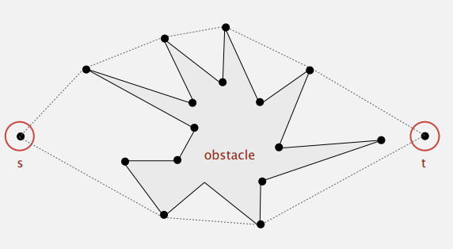
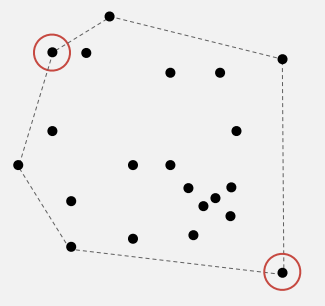

### 1.1-1
---

**排序**

- 操作系统对文件按更改时间排序

**凸壳**

- 运动规划：寻找从点s到点t的能够给避开多边形障碍物的最短路径

    

- 最远配对：给出平面上的 N 个点，从中选出欧氏距离最大的一对点

    

### 1.1-2

- 资源占用 (内存/CPU/网络)

### 1.1-3

数组，优势：随机存取快，局限：大小固定，删除中间元素慢

### 1.1-4

旅行商问题可以看做是对有向(无向)完全图中，起点和终点在一特定顶点，访问每个顶点恰好一次的最小化问题，
虽然都是寻找路径，但是旅行商问题有遍历顶点的约束

### 1.1-5

- 最优解：计算贷款利息
- 近似最佳：计算明日下雨概率

### ref

[1] [凸包问题](http://tianyuan11111.com/Convex-hull/)

[2] [旅行推销员问题](https://zh.wikipedia.org/wiki/%E6%97%85%E8%A1%8C%E6%8E%A8%E9%94%80%E5%91%98%E9%97%AE%E9%A2%98)

